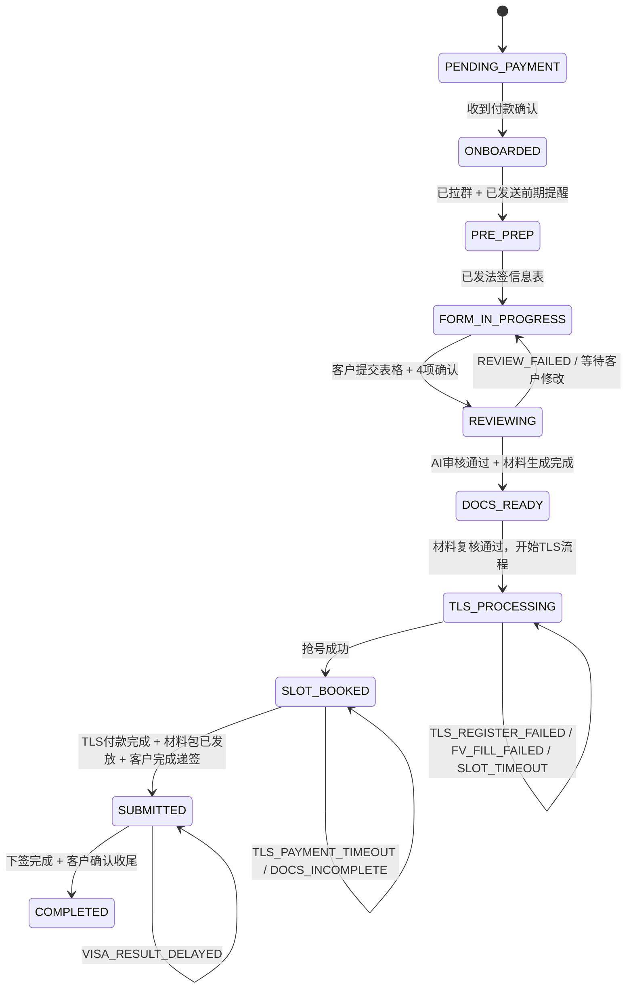

# 法签案件状态机与自动提醒规则 V1

## 说明

本文档用于给技术同事参考开发，目标是把当前法签 SOP 收敛成一套可执行的系统模型。

本版原则：

- 先做案件级进度状态，不先做 AI 自由生成逻辑
- 先做可控的规则触发，再考虑 AI 润色话术
- 主状态控制在 10 个节点
- 不包含“拒签”分支
- 异常统一通过 `exceptionCode` 和人工介入规则处理

---

## 一、状态机设计目标

当前系统里已经有很多自动化任务状态，例如：

- `pending`
- `running`
- `completed`
- `failed`

但这些只能表示“某个脚本有没有跑完”，不能表示“一个客户案件走到哪一步”。

因此，法签主流程需要新增“案件级状态机”。

建议结构：

- `mainStatus`：10 个主状态节点
- `subStatus`：更细的业务步骤
- `exceptionCode`：异常标签
- `statusHistory`：状态流转历史

---

## 二、10 个主状态节点

| 主状态 | 中文说明 | 进入条件 | 正常下一步 |
|---|---|---|---|
| `PENDING_PAYMENT` | 待付款 | 客户已咨询但未完成收款 | `ONBOARDED` |
| `ONBOARDED` | 已付款已入群 | 收款确认，已建群 | `PRE_PREP` |
| `PRE_PREP` | 前期资料准备 | 已提醒准备银行卡、流水、在读证明 | `FORM_IN_PROGRESS` |
| `FORM_IN_PROGRESS` | 表格进行中 | 已发信息表，等待客户提交 | `REVIEWING` |
| `REVIEWING` | AI审核与人工复核中 | 已收到表格并进入审核 | `DOCS_READY` |
| `DOCS_READY` | 材料已就绪 | 材料审核通过，文档已生成 | `TLS_PROCESSING` |
| `TLS_PROCESSING` | TLS 注册与抢号中 | 开始 TLS 注册、FV 填表、抢号 | `SLOT_BOOKED` |
| `SLOT_BOOKED` | 已抢到号，待递签 | 已抢号成功，待付款、待发包、待递签 | `SUBMITTED` |
| `SUBMITTED` | 已递签待结果 | 客户已递签 | `COMPLETED` |
| `COMPLETED` | 服务完成 | 下签完成，客户已确认收尾 | 终态 |

---

## 三、建议的 `subStatus`

`subStatus` 用于描述主状态下的具体步骤。

| mainStatus | subStatus | 说明 |
|---|---|---|
| `PENDING_PAYMENT` | `QUOTE_SENT` | 已报价，待付款 |
| `ONBOARDED` | `GROUP_CREATED` | 已拉群 |
| `PRE_PREP` | `BANK_CARD_PENDING` | 待确认银行卡 |
| `PRE_PREP` | `BALANCE_PREPARING` | 存款/流水准备中 |
| `FORM_IN_PROGRESS` | `FORM_SENT` | 已发法签信息表 |
| `FORM_IN_PROGRESS` | `FORM_RECEIVED` | 已收表，待入系统 |
| `REVIEWING` | `AI_REVIEWING` | AI 审核中 |
| `REVIEWING` | `HUMAN_REVIEWING` | 人工复核中 |
| `DOCS_READY` | `DOCS_GENERATED` | 材料包已生成 |
| `TLS_PROCESSING` | `TLS_REGISTERING` | TLS 账号注册中 |
| `TLS_PROCESSING` | `FV_FILLING` | FV 填表中 |
| `TLS_PROCESSING` | `SLOT_HUNTING` | 抢号中 |
| `TLS_PROCESSING` | `PENDING_SUBMISSION` | 待递签准备中 |
| `SLOT_BOOKED` | `WAITING_TLS_PAYMENT` | 抢号成功，待付款 |
| `SLOT_BOOKED` | `PACKAGE_SENT` | 已发材料包 |
| `SUBMITTED` | `AWAITING_VISA` | 等待下签 |
| `COMPLETED` | `APPROVED_NOTIFIED` | 已通知客户领取 |
| `COMPLETED` | `SERVICE_CLOSED` | 已收尾 |

---

## 四、异常标签 `exceptionCode`

异常不要做成主状态节点，而是作为案件标签挂在当前状态上。

| exceptionCode | 中文说明 | 适用状态 |
|---|---|---|
| `PAYMENT_TIMEOUT` | 付款超时未完成 | `PENDING_PAYMENT` |
| `BANK_CARD_MISSING` | 无英国本地银行卡 | `PRE_PREP` |
| `BALANCE_INSUFFICIENT` | 余额不足 | `PRE_PREP` |
| `FORM_TIMEOUT` | 表格长时间未提交 | `FORM_IN_PROGRESS` |
| `REVIEW_FAILED` | AI 审核未通过 | `REVIEWING` |
| `DOCS_REGENERATE_REQUIRED` | 材料需重生成 | `REVIEWING` / `DOCS_READY` |
| `TLS_REGISTER_FAILED` | TLS 注册异常 | `TLS_PROCESSING` |
| `FV_FILL_FAILED` | FV 填表异常 | `TLS_PROCESSING` |
| `SLOT_TIMEOUT` | 抢号超时 | `TLS_PROCESSING` |
| `TLS_PAYMENT_TIMEOUT` | TLS 付款超时 | `SLOT_BOOKED` |
| `DOCS_INCOMPLETE` | 递签材料不齐全 | `SLOT_BOOKED` |
| `VISA_RESULT_DELAYED` | 递签后 15 个工作日仍未出签 | `SUBMITTED` |

---

## 五、状态流转图

---

## 六、各主状态的进入与退出条件

### 1. `PENDING_PAYMENT`

进入条件：

- 客户已咨询
- 已报价
- 尚未完成收款

退出条件：

- 财务或客服确认已付款

### 2. `ONBOARDED`

进入条件：

- 已付款
- 已拉微信群

退出条件：

- 已完成入群提醒
- 已确认客户进入前期准备

### 3. `PRE_PREP`

进入条件：

- 已发送前期资料提醒

退出条件：

- 已确认银行卡
- 已说明存款和流水要求
- 可开始发正式表格

### 4. `FORM_IN_PROGRESS`

进入条件：

- 已发送法签信息表

退出条件：

- 客户完成表格提交
- 4 个确认项已确认

### 5. `REVIEWING`

进入条件：

- 表格已收齐
- 已录入系统

退出条件：

- 审核通过，材料生成完成

回退条件：

- 审核失败
- 材料逻辑不一致
- 需要客户补充信息

### 6. `DOCS_READY`

进入条件：

- 行程单、酒店、机票、解释信等材料已生成

退出条件：

- 已确认开始 TLS 流程

### 7. `TLS_PROCESSING`

进入条件：

- 已开始 TLS 注册 / FV 填表 / 抢号

退出条件：

- 已抢号成功

异常停留条件：

- TLS 注册失败
- FV 回执/表单填写异常
- 抢号超时

### 8. `SLOT_BOOKED`

进入条件：

- 已抢到号

退出条件：

- TLS 付款完成
- 材料包已发放
- 客户完成递签

异常停留条件：

- TLS 付款未完成
- 材料不齐全

### 9. `SUBMITTED`

进入条件：

- 客户已递签

退出条件：

- 已下签
- 已完成领取/收尾确认

异常停留条件：

- 超过 15 个工作日未出签

### 10. `COMPLETED`

进入条件：

- 已下签
- 客户拿到护照
- 核查签证信息完成

退出条件：

- 无

---

## 七、18 条自动提醒规则 V1

说明：

- `类型` 用于前端筛选，可选：`全自动 / 人工介入`
- `优先级` 用于前端筛选，可选：`普通 / 紧急`
- `渠道` 用于前端筛选，可选：`微信群 / 邮件 / 内部任务`
- 本版先使用固定模板，不做 AI 自由生成

| # | ruleCode | 规则名称 | 触发条件 | 渠道 | 类型 | 优先级 | 延迟 |
|---|---|---|---|---|---|---|---|
| 1 | `PAYMENT_SUCCESS_WELCOME` | 付款成功欢迎包 | 收款状态变为已付款 | 微信群 | 全自动 | 普通 | 立即 |
| 2 | `ONBOARD_DAY3_ENROLLMENT_CERT` | 入群后第3天在读证明催促 | `ONBOARDED` 满72h且证明未确认 | 微信群 | 全自动 | 普通 | 72h |
| 3 | `PREP_DAY7_BALANCE_CHECK` | 入群后第7天余额检查 | `PRE_PREP` 满7天且表格未提交 | 微信群 | 全自动 | 普通 | 7天 |
| 4 | `FORM_24H_NOT_SUBMITTED` | 表格24h未提交 | `FORM_IN_PROGRESS:FORM_SENT` 满24h | 微信群 | 全自动 | 普通 | 24h |
| 5 | `FORM_48H_ESCALATION` | 表格48h未提交 | `FORM_IN_PROGRESS:FORM_SENT` 满48h | 内部任务 | 人工介入 | 紧急 | 48h |
| 6 | `REVIEW_FAIL_FEEDBACK` | AI审核不通过修改建议 | `exceptionCode=REVIEW_FAILED` | 微信群 | 全自动 | 普通 | 立即 |
| 7 | `DOCS_READY_NOTICE` | 材料生成完成通知 | 状态变为 `DOCS_READY` | 微信群 | 全自动 | 普通 | 立即 |
| 8 | `SLOT_HUNTING_DAY3_UPDATE` | 提交抢号后第3天进度更新 | `TLS_PROCESSING:SLOT_HUNTING` 满72h | 微信群 | 全自动 | 普通 | 72h |
| 9 | `SLOT_WINDOW_ENDING` | 临近抢号区间结束 | 距区间结束前3天 | 内部任务 | 人工介入 | 紧急 | 3天前 |
| 10 | `SLOT_BOOKED_PAYMENT_NOTICE` | 抢号成功付款提醒 | 状态变为 `SLOT_BOOKED` | 微信群 | 全自动 | 普通 | 30分钟内 |
| 11 | `TLS_PAYMENT_2H_ESCALATION` | 抢号成功2h未付款 | `SLOT_BOOKED` 后2h未付款 | 内部任务 | 人工介入 | 紧急 | 2h |
| 12 | `PACKAGE_SEND_T_MINUS_3` | 递签前3天材料包发放 | 递签日 - 今天 = 3天 | 微信群 | 全自动 | 普通 | 自动 |
| 13 | `T_MINUS_1_FINAL_REMINDER` | 递签前1天最终提醒 | 递签日 - 今天 = 1天 | 微信群 | 全自动 | 普通 | 自动 |
| 14 | `SUBMITTED_CONGRATS` | 递签完成恭喜消息 | 状态变为 `SUBMITTED` | 微信群 | 全自动 | 普通 | 立即 |
| 15 | `SUBMITTED_DAY5_COMFORT` | 第5工作日安抚 | `SUBMITTED` 满5个工作日 | 微信群 | 全自动 | 普通 | 第5天 |
| 16 | `SUBMITTED_DAY15_ESCALATION` | 超过15工作日未下签 | `SUBMITTED` 满15个工作日 | 内部任务 | 人工介入 | 紧急 | 第15天 |
| 17 | `VISA_APPROVED_NOTIFY` | 下签成功通知领取 | 状态进入 `COMPLETED:APPROVED_NOTIFIED` | 微信群+邮件 | 全自动 | 普通 | 立即 |
| 18 | `SERVICE_CLOSED_REVIEW_INVITE` | 服务完成邀请好评 | 状态进入 `COMPLETED` 满3天 | 微信群 | 全自动 | 普通 | 3天后 |

---

## 八、提醒规则建议字段

后端建议每条规则至少具备以下字段：

| 字段 | 类型 | 说明 |
|---|---|---|
| `ruleCode` | string | 唯一编码 |
| `name` | string | 规则名 |
| `enabled` | boolean | 是否启用 |
| `mainStatus` | string | 对应主状态 |
| `subStatus` | string? | 对应子状态，可空 |
| `exceptionCode` | string? | 对应异常码，可空 |
| `triggerType` | enum | `status_enter` / `duration_reached` / `date_offset` / `field_missing` |
| `triggerValue` | json | 触发条件结构体 |
| `delayMinutes` | int | 延迟分钟数 |
| `channel` | json | `["WECHAT"]` / `["EMAIL"]` / `["INTERNAL"]` |
| `automationMode` | enum | `AUTO` / `MANUAL` |
| `severity` | enum | `NORMAL` / `URGENT` |
| `templateCode` | string | 话术模板编码 |
| `cooldownMinutes` | int | 冷却时间，防重复触发 |
| `stopCondition` | json | 停止发送条件 |
| `createdAt` | datetime | 创建时间 |
| `updatedAt` | datetime | 更新时间 |

---

## 九、建议的数据库表

### 1. `visa_cases`

用于保存一个客户案件的当前状态。

建议字段：

- `id`
- `userId`
- `applicantProfileId`
- `caseType`
- `mainStatus`
- `subStatus`
- `exceptionCode`
- `priority`
- `assignedRole`
- `paymentConfirmedAt`
- `formSubmittedAt`
- `docsReadyAt`
- `slotBookedAt`
- `submittedAt`
- `completedAt`
- `nextActionAt`
- `createdAt`
- `updatedAt`

### 2. `visa_case_status_history`

用于保存状态流转历史。

建议字段：

- `id`
- `caseId`
- `fromMainStatus`
- `fromSubStatus`
- `toMainStatus`
- `toSubStatus`
- `exceptionCode`
- `reason`
- `operatorType`
- `operatorId`
- `createdAt`

### 3. `reminder_rules`

用于保存提醒规则。

建议字段：

- `id`
- `ruleCode`
- `name`
- `enabled`
- `mainStatus`
- `subStatus`
- `exceptionCode`
- `triggerType`
- `triggerValue`
- `delayMinutes`
- `channel`
- `automationMode`
- `severity`
- `templateCode`
- `cooldownMinutes`
- `stopCondition`
- `createdAt`
- `updatedAt`

### 4. `reminder_logs`

用于保存每次提醒发送记录。

建议字段：

- `id`
- `caseId`
- `ruleId`
- `ruleCode`
- `channel`
- `automationMode`
- `severity`
- `templateCode`
- `renderedContent`
- `sendStatus`
- `errorMessage`
- `triggeredAt`
- `sentAt`

---

## 十、固定模板与 AI 的分工建议

### 第一阶段：不要把触发逻辑交给 AI

必须由系统自己控制的部分：

- 状态切换
- 延迟计时
- 规则命中
- 去重
- 冷却
- 升级人工
- 渠道选择

### 第二阶段：可以交给 AI 的部分

可以后置给 AI 的部分：

- 话术润色
- 客户情绪安抚
- 个性化补充说明
- 修改建议的自然语言展开
- 特殊情况说明模板优化

结论：

- 先做“确定性规则引擎”
- 再做“AI 辅助生成文案”

---

## 十一、开发优先级建议

### P0

- 新增案件级状态字段
- 建立 `visa_cases`
- 建立 `visa_case_status_history`
- 确定 10 节点主状态流转

### P1

- 新增 `reminder_rules`
- 新增 `reminder_logs`
- 跑通 18 条提醒规则
- 前端支持按“全自动 / 人工介入 / 紧急 / 微信 / 邮件”筛选

### P2

- 话术模板编辑器
- 模板变量替换
- AI 润色按钮
- 管理后台的提醒审计页

---

## 十二、V1 结论

本版建议的核心不是先做 AI，而是：

1. 先把法签业务收敛成 10 个主状态
2. 用 `subStatus` 承接细步骤
3. 用 `exceptionCode` 承接异常
4. 让 18 条提醒规则全部挂在案件状态机上运行

只有这样，后面不管是：

- 微信提醒
- 邮件提醒
- 人工介入任务
- AI 生成话术

才会有统一、稳定、可审计的基础。
